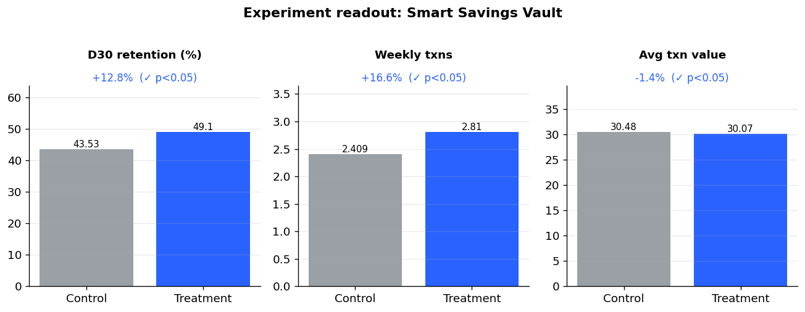
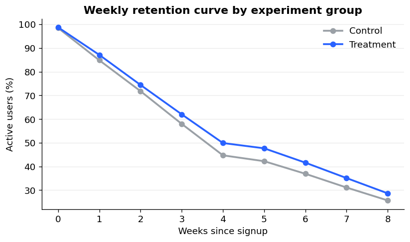
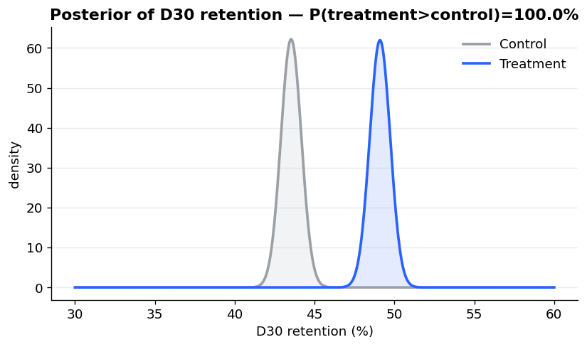

# Smart Savings Vault — Neobank A/B Test & Retention Analytics

End-to-end analytics pipeline on a synthetic **neobank** dataset (Revolut-style):
**SQL → Python → A/B test → dashboard**. Built to answer a single product
question the way a data scientist would defend it in a review:

> *We launched a "Smart Savings Vault" (round-ups on card payments). Did it
> increase 30-day retention without hurting transaction quality — and should we ship it?*

[](#)
[](#)
[](#)
[](#)

---

## TL;DR — the result

| Metric | Type | Control | Treatment | Lift | Significance |
|---|---|--:|--:|--:|---|
| **D30 retention** | primary | 43.5% | 49.1% | **+5.6pp (+12.8%)** | p < 0.001 ✅ |
| Weekly active transactions | secondary | 2.41 | 2.81 | **+16.6%** | p < 0.001 ✅ |
| Avg transaction value | guardrail | 30.48 | 30.07 | −1.4% | p = 0.017 |

**Decision: SHIP.** The primary metric improves with a 95% CI of **[+3.8pp, +7.4pp]**
and a Bayesian **P(treatment > control) = 100%**. The guardrail is *statistically*
significant but the −1.4% move is **below a 2% practical threshold** — with n ≈ 12k,
trivial differences turn significant, so it is not a launch blocker. Distinguishing
**statistical vs practical significance** is the core judgment call here.

<p align="center">
  <br>
  
  
</p>

---

## Why this project

It mirrors the day-to-day of a Revolut Data Scientist & Analyst: writing
**SQL** against an event warehouse, reasoning about **experiments and metrics**,
and turning analysis into a **dashboard** for a product team. Every number above
is reproduced by the code in this repo — `git clone` and run the three commands.

## What it demonstrates

- **SQL** — cohort retention with CTEs, `JULIANDAY` date math, `RANK() OVER (PARTITION BY …)`
  window functions, conditional aggregation, and a self-contained experiment readout
  (`sql/01_cohort_retention.sql`, `sql/02_experiment_readout.sql`).
- **Experimentation** — two-proportion z-test, Welch's t-test + Mann-Whitney robustness
  check, a guardrail metric, **power analysis / minimum detectable effect**, and a
  **Bayesian Beta-Binomial** posterior (`src/ab_test.py`).
- **Engineering** — a clean CSV → SQLite ETL, deterministic seeded data, modular code,
  and a **pytest** suite that verifies the stats recover a known seeded effect.
- **Communication** — an interactive **Streamlit** dashboard with metric cards,
  significance table, and a segment explorer (by plan / country / channel).

## Run it (≈30 seconds)

```bash
pip install -r requirements.txt

python data/generate_data.py     # 1. synthetic users + 400k transactions
python src/etl.py                # 2. load into a local SQLite warehouse
python src/run_analysis.py       # 3. stats + figures + reports/results.json

streamlit run dashboard/app.py   # optional: interactive dashboard
pytest -q                        # run the test suite
```

## Project structure

```
revolut-fintech-analytics/
├── data/
│   └── generate_data.py       # seeded synthetic neobank dataset
├── sql/
│   ├── 01_cohort_retention.sql    # CTEs + window functions, weekly cohorts
│   └── 02_experiment_readout.sql  # per-user metrics + group readout
├── src/
│   ├── etl.py                 # CSV -> SQLite warehouse (+ schema, indexes)
│   ├── ab_test.py             # frequentist + Bayesian experiment analysis
│   ├── viz.py                 # matplotlib charts
│   └── run_analysis.py        # orchestrator -> results.json + figures
├── dashboard/
│   └── app.py                 # Streamlit dashboard
├── tests/
│   └── test_ab_test.py        # pytest: recovers the seeded effect
└── reports/figures/           # generated charts (committed for the README)
```

## Methodology notes

- **Data is synthetic and seeded** (control D30 = 42%, +3.5pp treatment lift, +8%
  activity) so the analysis has a known ground truth to recover — and so nothing
  here touches real customer data.
- **Confounders are intentional.** Premium/Metal plans and referral users retain
  better in the generator, which is why the dashboard's segment explorer matters:
  the headline lift should hold *within* segments, not just in aggregate.
- **Revenue** is a simple interchange proxy (0.20% of card spend) — directional, not
  a real P&L.

---

*Synthetic data, built as a portfolio project. Not affiliated with Revolut.*
